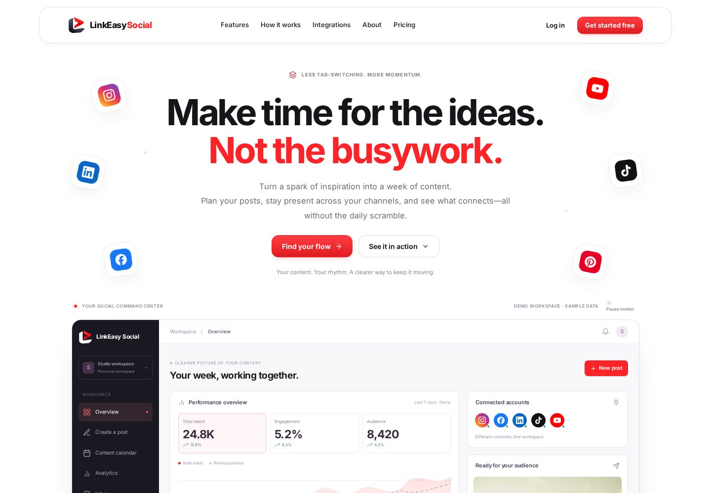
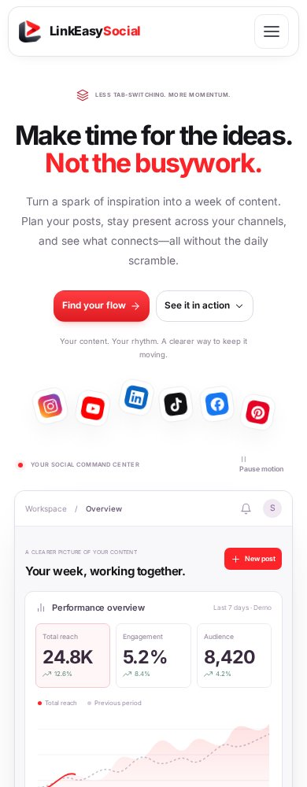
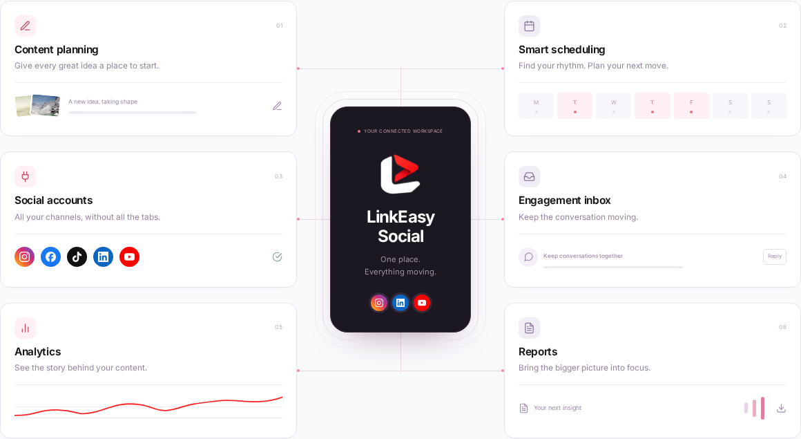
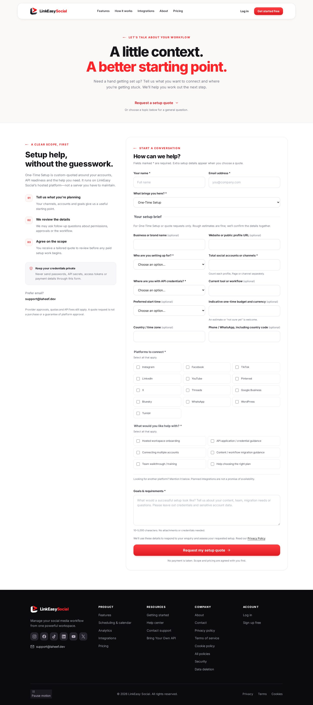
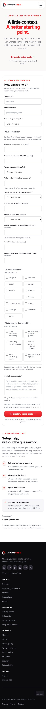
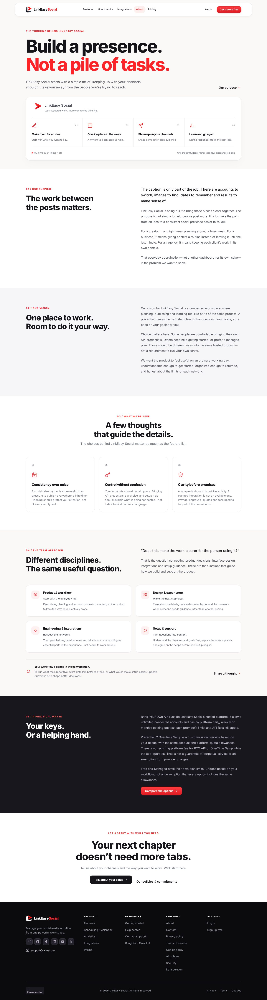
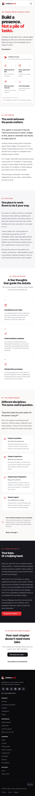

<p align="center">
  
</p>

<h1 align="center">LinkEasy Social</h1>
<p align="center"><strong>Make time for the ideas. Not the busywork.</strong><br>A connected place to plan your social presence—with a polished public website, account foundation and guided setup enquiries.</p>

<p align="center">
  <a href="#screenshots">Screenshots</a> ·
  <a href="#quick-start">Quick start</a> ·
  <a href="docs/OPERATIONS.md">Operations guide</a> ·
  <a href="docs/BOOK_AUDIT.md">Engineering audit</a>
</p>



> **Project status — please read first**
>
> This repository contains the **public website and PHP account/contact/billing integration foundation**. The homepage dashboard is a clearly labelled demonstration, not live customer analytics. The authenticated `/dashboard` is an integration point for the existing social application: a production publishing engine, social-token vault, media pipeline and analytics ingestion are **not implemented in this repository**.
>
> Contact and password-reset notifications use a background mail queue. **Configure SMTP and schedule the worker before expecting email delivery.** Google/PayPal require real configuration and acceptance tests; payments default to disabled. See the [production checklist](PRODUCTION_CHECKLIST.md).

## Contents

- [What this project includes](#what-this-project-includes)
- [Screenshots](#screenshots)
- [Quick start](#quick-start)
- [Configuration](#configuration)
- [Database setup and upgrades](#database-setup-and-upgrades)
- [Email and background jobs](#email-and-background-jobs)
- [Google and PayPal](#google-and-paypal)
- [Architecture and routes](#architecture-and-routes)
- [Customizing the website](#customizing-the-website)
- [Plan and platform configuration](#plan-and-platform-configuration)
- [Testing and CI](#testing-and-ci)
- [Security and data handling](#security-and-data-handling)
- [Deployment and scaling](#deployment-and-scaling)
- [Troubleshooting](#troubleshooting)
- [Documentation, contributions and licensing](#documentation-contributions-and-licensing)

## What this project includes

### Public website

- Responsive, light-themed landing page with the original LinkEasy Social 3D mark.
- Benefit-led hero copy and six floating social-platform icons above the product preview.
- **Command dashboard illustration:** switchable sample metrics, chart, scheduled-content examples, connected-account icons and a real-image post preview.
- **Connected Flow section:** six visual workflow modules around a central workspace.
- Narrowing sticky navigation, mobile menu, pricing controls, FAQ accordion and platform catalogue.
- Motion pause controls, reduced-motion support and offscreen animation pausing.
- Product-specific About page describing purpose, vision and team functions—without invented staff biographies.
- Shared public navigation/footer, help pages, sitemap, SEO metadata and configurable official social links.
- Privacy, terms, security, copyright, refunds and other policy **drafts** requiring operator/legal review.

### Accounts, enquiries and reliability

- Email/password signup and login, server-checked terms acknowledgement, password hashing and session rotation.
- Single-use password reset with invalidation of older authenticated sessions.
- Google authorization-code integration with PKCE and verified profile checks; no automatic account linking by matching email.
- Protected dashboard integration point, ownership helpers and configuration-driven plan gates.
- Short general contact form and expanded setup-quote brief for selected quote topics.
- Server-side quote validation, retained error values and no-JavaScript form fallback.
- Atomic contact/reset persistence and mail outbox, including contact-submission deduplication.
- CLI mail worker, claim leases, expiry, bounded retries/backoff and dead-letter handling.
- SQLite and MySQL/MariaDB schema paths, additive migrations and indexed database rate limits.
- Bounded trusted-provider HTTP, circuit breaking, structured metadata logs and private operational tools.
- PayPal checkout/webhook integration foundation with explicit enablement, signature verification, ownership/plan binding and replay protection.

### What still needs integration or production verification

| Area | Current boundary |
|---|---|
| Social publishing, scheduling and analytics | Illustrative public UI; connect the existing social engine at `/dashboard` |
| Social API credentials | No implemented production vault/token lifecycle in this repository |
| Uploads and media processing | No public upload or arbitrary URL-fetch endpoint; the visual media library is a mock |
| Email | Durable queue implemented; actual SMTP delivery and cron must be configured/tested |
| Google and PayPal | Server-side integration code exists; real provider acceptance is required |
| Hosted operations | TLS/DNS, backups, retention, alerting and capacity need operator setup |
| Multi-node deployment | Shared DB logic exists; shared sessions and centralized operations are still required |

## Screenshots

These are screenshots of the actual rendered website from the September 2026 QA pass—not proposed designs. Any analytics figures in them are **sample data**. Images are stored in this repository, so the gallery does not depend on an external image host.

### Desktop and mobile homepage

The large preview above shows the desktop layout. On smaller screens, the social icons form a floating row between the copy and the dashboard.



### Connected workflow



<details>
<summary><strong>Setup quote form — desktop and mobile</strong></summary>

The quote brief collects accounts, platforms, API readiness, required assistance and optional budget/timing context. General enquiries do not need the full brief.





</details>

<details>
<summary><strong>About LinkEasy Social — purpose, vision and team functions</strong></summary>





</details>

See the [screenshot index](docs/screenshots/README.md) for image sources and refresh instructions. Historical QA screenshots remain under `qa/`; the gallery above selects the current public design.

## Quick start

The commands below assume Bash on Linux, macOS or WSL. Use an equivalent PHP environment on Windows.

### 1. Requirements

| Component | Requirement |
|---|---|
| PHP | 8.2+; engineering tests were run on PHP 8.4 |
| PHP extensions | PDO SQLite **or** PDO MySQL, mbstring, cURL and OpenSSL |
| Database | SQLite for a simple local start; MySQL/MariaDB for a shared deployment |
| Node.js | Optional for running the website; use Node 22 for the locked build/QA tools |
| Python | Optional for tooling; use Python 3.11+ for the pinned image-builder requirements |
| Web server | PHP development server locally; Apache/LiteSpeed or correctly configured Nginx/PHP-FPM for deployment |

Example Debian/Ubuntu runtime packages:

```bash
sudo apt-get update
sudo apt-get install php-cli php-sqlite3 php-curl php-mbstring
# Add php-mysql if using MySQL/MariaDB.
```

### 2. Clone and create private local configuration

```bash
git clone https://github.com/laheef/LinkEasy-Social.git
cd LinkEasy-Social
cp .env.example .env
mkdir -p storage/logs
chmod 600 .env
```

**GitHub does not contain your actual `.env`, database or logs.** `.env.example` documents the required settings. Do not commit passwords, tokens or customer data.

Edit the following values in your new `.env` for a local HTTP preview; retain the other example settings:

```dotenv
APP_ENV="local"
APP_URL="http://localhost:8080"
APP_DEBUG="false"
APP_FORCE_HTTPS="false"
DATABASE_DSN=""
MAIL_DRIVER="log"
MAIL_LOG_CONTENT="false"
PAYPAL_ENABLED="false"
```

A blank database DSN uses `storage/linkeasy.sqlite`. The default example is production-oriented, so change **both** `APP_ENV` and `APP_URL` for local HTTP use.

### 3. Initialize the database and start the site

```bash
php tools/migrate.php
php -S 0.0.0.0:8080 -t public public/router.php
```

Open **http://localhost:8080**. Stop the development server with `Ctrl+C`.

Prebuilt CSS/JS, fonts and images are already committed. You do **not** need npm, Composer, Python or a frontend development server merely to view the website. The PHP development server is not a production server.

### 4. Check the available flows

- Browse `/`, `/about`, `/contact`, `/help` and `/legal`.
- Open `/contact?subject=One-Time%20Setup` to see the expanded quote brief.
- Create a test account at `/signup`; the protected dashboard starts on the configured Free plan.
- Follow the email instructions below before testing an actual reset-email delivery.
- Run `php tools/check_production.php` to identify configuration gaps. `ACTION`, `DISABLED` and `MANUAL` results are expected for unconfigured local/provider settings.

## Configuration

Start with [`.env.example`](.env.example). Configuration is loaded on the server; provider secrets are not shipped to browser JavaScript. Boot-time checks reject invalid environment values.

| Setting group | Purpose |
|---|---|
| `APP_NAME`, `APP_URL`, `APP_ENV`, `APP_DEBUG`, `APP_TIMEZONE` | Identity, canonical origin, environment and diagnostics |
| `APP_FORCE_HTTPS`, `TRUSTED_PROXY_IPS` | Production HTTPS policy and explicit upstream proxy trust |
| `DATABASE_DSN`, `DATABASE_USER`, `DATABASE_PASS` | SQLite or MySQL/MariaDB connection |
| `MAIL_DRIVER`, `MAIL_FROM_ADDRESS`, `MAIL_FROM_NAME`, `SUPPORT_EMAIL` | Notification transport, sender and enquiry recipient |
| `SMTP_HOST`, `SMTP_PORT`, `SMTP_SECURE`, `SMTP_USER`, `SMTP_PASS` | Real SMTP delivery |
| `MAIL_LOG_CONTENT` | Explicit non-production email-body logging for synthetic tests only |
| `GOOGLE_CLIENT_ID`, `GOOGLE_CLIENT_SECRET`, `GOOGLE_REDIRECT_URI` | Google sign-in; blank redirect derives from `APP_URL` |
| `PAYPAL_ENABLED`, `PAYPAL_MODE`, `PAYPAL_*_ID`, `PAYPAL_CLIENT_SECRET` | Explicit checkout gate, environment, credentials, plans and webhook |
| `PRICE_MANAGED_MONTHLY`, `PRICE_MANAGED_YEARLY` | Public Managed plan price configuration |
| `SOCIAL_*_URL` | Official footer profile links; blank values remain non-clickable |

For production, use the actual HTTPS domain, `APP_ENV=production`, `APP_DEBUG=false` and `APP_FORCE_HTTPS=true`. Trust only known proxy IPs—not every client or arbitrary forwarded headers. Never put `.env` inside the web document root.

## Database setup and upgrades

### SQLite

The default file is created under private `storage/`. Run `php tools/migrate.php` when installing or updating. Use local disk, not a network-shared SQLite file; writes are serialized.

### MySQL / MariaDB

Create an empty database and a dedicated application database user, then configure:

```dotenv
DATABASE_DSN="mysql:host=localhost;dbname=your_database;charset=utf8mb4"
DATABASE_USER="your_database_user"
DATABASE_PASS="your_private_database_password"
```

Run:

```bash
php tools/migrate.php
```

The migration tool creates baseline tables if absent and applies ordered, checksum-verified upgrades. Tables use the `les_` prefix. The MySQL-compatible path was exercised on **MariaDB 11.8.6**; this is not a claim of testing every database/hosting version.

### Updating an existing installation

1. Back up deployed code, `.env`, database and uploads; verify restoration.
2. Enter maintenance mode and drain old workers where appropriate.
3. Update source and prebuilt assets **without replacing production configuration/data**.
4. Review new `.env.example` settings and run `php tools/migrate.php`.
5. Run smoke tests, restart/reschedule workers as needed and restore traffic.

Do not edit an applied migration. MySQL DDL may commit partially; a failed migration needs maintenance-mode recovery, not blind reruns. See the [full upgrade runbook](docs/OPERATIONS.md#updating-an-existing-installation).

## Email and background jobs

### How notification delivery works

```text
Browser form
    |
    v
Validation + CSRF + rate limit
    |
    v
Database transaction
    +-- contact message / reset token
    +-- mail outbox job
    |
    v
Response to visitor

Cron --> CLI worker --> claim job --> SMTP --> sent / delayed retry / dead letter
```

The database record and notification job commit together. Slow SMTP does not hold the original form request open.

### Configure real SMTP

Set `MAIL_DRIVER=smtp`, use your actual provider's host/mailbox settings and choose `ssl` (typically port 465) or `tls` (typically port 587). Keep `MAIL_LOG_CONTENT=false` in production. Native PHP `mail()` is not supported by this bounded worker.

Run a batch manually:

```bash
php tools/worker.php --max-jobs=20 --max-seconds=45
```

For production, schedule it every minute with the correct PHP executable and **private project path**:

```cron
* * * * * /usr/bin/php /private/path/LinkEasy-Social/tools/worker.php --max-jobs=20 --max-seconds=45
```

The time budget is checked between jobs; an in-flight bounded delivery can finish after that budget. Jobs have token-owned leases, exponential backoff with jitter, a five-attempt limit and expiry handling. SMTP is **at least once**: a crash after remote acceptance can result in a duplicate email on retry.

### Local testing without sending email

For synthetic test data only, use `APP_ENV=local` or `test`, `MAIL_DRIVER=log` and explicitly enable `MAIL_LOG_CONTENT=true`. Run the worker, then inspect the private `storage/logs/mail.log`. It may contain reset links; never publish or commit it.

With the default `MAIL_LOG_CONTENT=false`, or in production with the log driver, **mail is not delivered or reported as sent**. Jobs retry and can reach a dead-letter state. Configure SMTP before opening the form to real users.

### Operational commands

```bash
# Private cursor-paginated job metadata: after-id 0, up to 25 rows.
php tools/ops.php status 0 25

# After fixing SMTP, explicitly requeue a stored contact notification.
php tools/ops.php resend-contact CONTACT_ID --confirm

# Retention dry run. Review before adding --apply.
php tools/ops.php prune 30
```

Monitor queue age, dead jobs and worker heartbeat log events. Sent/dead mail payloads are scrubbed. The prune command does not delete customers, contact messages, subscriptions or payment events; those require an approved retention/deletion policy.

## Google and PayPal

### Google sign-in

1. Configure a Google OAuth web application and its client ID/secret in private environment settings.
2. Register the exact callback, such as `https://your-domain.example/auth/google/callback`.
3. Set `GOOGLE_REDIRECT_URI`, or leave it blank to derive it from the configured app origin.
4. Test consent, rejection, state expiry and callback behavior with real provider configuration.

The code uses PKCE and verified profile data. An existing password account is **not automatically linked by matching its email**; use that account's original sign-in method. A separate reauthenticated account-linking UI is not included.

### PayPal subscriptions

Keep `PAYPAL_ENABLED=false` until sandbox acceptance is complete. Configure sandbox credentials, monthly/yearly plan IDs and the webhook ID, then use the explicit enablement flag for controlled testing.

| Endpoint | Role |
|---|---|
| `GET /billing/paypal/create` | Read-only confirmation page, or configuration guidance |
| `POST /billing/paypal/create` | Authenticated, CSRF-protected subscription creation |
| `/billing/paypal/return` | Return screen; not proof that paid access was granted |
| `/billing/paypal/cancel` | Checkout cancellation navigation |
| `POST /billing/paypal/webhook` | Verified server-to-server lifecycle processing |

Only verified, supported lifecycle events with a matching canonical provider plan/user and locally owned subscription can change entitlements. Browser query parameters cannot grant a paid plan. Test creation, approval, cancellation, suspension, expiry, duplicates, wrong binding and reconciliation before live operation. Review paid-through/grace-period policy with the actual backend; this is not a complete financial ledger.

## Architecture and routes

```text
LinkEasy-Social/
├── public/                    # ONLY directory served by the web server
│   ├── index.php              # Front controller
│   ├── router.php             # Local PHP development router
│   └── assets/                # Committed CSS/JS, fonts, logo and media
├── views/                     # PHP templates and shared UI partials
├── routes/web.php             # Public, auth, contact and billing routes
├── src/                       # Auth, validation, DB, request/security helpers
│   └── Services/              # Queue, SMTP, reset, contact, OAuth and billing
├── config/                    # Product, route, pricing and policy configuration
├── database/                  # SQLite/MySQL baselines and additive migrations
├── storage/                   # Private local runtime data; not committed
├── tools/                     # Build, migration, worker, ops and QA commands
├── docs/                      # Audit, runbook, project notes and screenshots
├── qa/                        # Recorded local test evidence and design history
├── .github/workflows/qa.yml    # Build and test gates; no automatic deployment
├── .env.example               # Safe configuration template
└── package-lock.json          # Locked development tooling
```

Main visitor routes: `/`, `/about`, `/contact`, `/help`, `/legal`, `/privacy`, `/terms`, `/security`, `/copyright`, `/refunds` and `/sitemap.xml`.

Account routes: `/signup`, `/login`, `/logout` (POST), `/forgot-password`, `/reset-password`, `/auth/google`, `/auth/google/callback`, `/auth/session-check` and protected `/dashboard`.

**Existing-app integration:** preserve the auth/ownership boundaries and replace or integrate `views/dashboard/index.php` with the real application. Map user records through `src/Auth.php` if an existing identity model already exists. Do not create a competing account database blindly or apply scaffold gates without checking the real tenant/resource permissions.

## Customizing the website

| Change | Location |
|---|---|
| Brand, routes, price/plan allowances, FAQ | `config/app.php` and `.env` price settings |
| Quote subjects, required details and help options | `config/contact.php` |
| Quote validation and serialization | `src/ContactInquiry.php` |
| Public policy text and draft flags | `config/public-pages.php` |
| Platform catalogue and source generator | `config/platforms.generated.php`, `tools/build_platforms.py` |
| Hero/dashboard preview | `views/landing/sections/hero.php` |
| Connected Flow visual | `views/landing/sections/workspace.php` |
| Contact / About layout | `views/contact/index.php`, `views/pages/about.php` |
| Styles | `public/assets/css/parts/`; ordered entry at `landing.css` |
| Browser interactions | `public/assets/js/main.js` |

### Rebuild CSS/JS after source edits

```bash
npm ci --ignore-scripts
npm run build
```

Commit both edited source and rebuilt minified files. Seven CSS modules bundle into one stylesheet request; the runtime does not load a frontend framework or depend on a CDN.

### Optional image/brand builders

```bash
python3 -m venv .venv
.venv/bin/python -m pip install -r tools/requirements.txt
```

Build scripts are documented in [`tools/README.md`](tools/README.md). Original logo geometry and offline font/icon inputs are retained under `tools/sources/`. Preserve the full 3D ribbon/red chevron—do not flatten or redesign the brand mark. Regenerate assets deliberately and review the output before committing.

## Plan and platform configuration

The following are **configured product allowances**, not evidence that the missing social engine is already operational. Keep actual backend enforcement consistent with the configuration.

| Plan | Connected accounts | Projects | Scheduled-post queue | Default price model |
|---|---:|---:|---:|---|
| Free | 3 | 1 | 30 | $0 |
| Bring Your Own API | Unlimited | Unlimited | No platform quota | $0/month platform fee |
| One-Time Setup | Unlimited | Unlimited | No platform quota | Custom one-time quote |
| Managed | 25 | 10 | Unlimited | $19/month or $190/year |

BYO API is **hosted on LinkEasy Social**, not a self-hosted requirement. One-Time Setup is paid onboarding for that hosted approach. There is no recurring platform fee for those options while the app operates—not a perpetual service guarantee. Provider API fees, quotas, approvals and network policies still apply. Unlimited connected accounts are **not** offered on Free or Managed.

The website catalogue contains **60 platform entries: 13 marked available and 47 planned**. Planned entries stay labelled “Soon.” These catalogue labels must be reconciled with the real social backend before launch; they are not 60 implemented connectors in this repository.

## Testing and CI

### Fast local checks

Run with development dependencies installed:

```bash
php tools/qa-contact.php
php tools/qa-engineering.php
python3 tools/qa-concurrency.py
npm audit
```

The engineering/concurrency scripts use temporary SQLite data by default. Their optional MySQL modes require explicitly named **dedicated test databases**; read their safeguards before use. Do not point tests at customer data.

### Browser regression checks

```bash
npx playwright install --with-deps chromium
# Start the PHP development server in a separate terminal first.
npm run test:ui
node tools/qa-performance.cjs http://127.0.0.1:8080/
```

Public and Command checks cover 360, 390, 768, 1024 and 1440px. Refinement tests also cover 900px, quote-field switching, reduced motion and no-JavaScript behavior.

`qa-contact-http.py` and `qa-security-browser.cjs` **write synthetic account/contact/reset data**. They require a separately extracted, marked test copy; the workflow and [QA tool guide](tools/README.md) show the procedure. Do not run them against production.

### Recorded engineering evidence

The September 2026 audit recorded:

- 73 engineering assertions on SQLite and 73 on the MariaDB/MySQL-compatible path.
- Concurrent requests, unique job claims, abandoned lease recovery and single-use reset checks.
- Browser signup, reset, session revocation, CSRF, redirect, input-limit and private-path checks.
- Responsive/public UI checks and extracted-package acceptance.
- Dependency advisory scans and local performance samples.

Read the [complete 47-block audit](docs/BOOK_AUDIT.md) and [machine-readable evidence](qa/book-audit/README.md). Results are dated local evidence—not a penetration-test certification, live-provider certification or permanent dependency-safety guarantee.

### GitHub Actions

[`.github/workflows/qa.yml`](.github/workflows/qa.yml) defines build, dependency, PHP, concurrency, browser and extracted-package gates. It uses pinned action revisions and read-only repository permissions. It deliberately **does not deploy** or hold production provider secrets. Check the repository's Actions tab for the actual result of a pushed commit; local evidence is not a substitute for that run.

## Security and data handling

- Server-side schema/allowlist validation, bounded form/webhook input and rejected public file uploads.
- Prepared queries, transactional related writes, unique-key deduplication and fail-closed unknown plan gates.
- Salted adaptive password hashes, strict session IDs, rotation, idle/absolute expiry and reset-driven revocation.
- Nonempty CSRF tokens for browser mutations; verified signatures for provider webhooks.
- Nonce-based script CSP, no-store session-bearing HTML, safe redirects, explicit proxy trust and production HTTPS policy.
- Trusted-provider-only outbound HTTPS with response caps, deadlines, safe-only retry and circuit breaking.
- Structured logs allow approved metadata; no raw tokens, mail bodies or provider payloads in production telemetry.
- Private queue payloads can contain contact details/reset links until processing; restrict DB access and encrypt host storage/backups. No application-level credential vault is claimed.

Do not publish security-sensitive reports as public issues or attach `.env`, tokens or logs. Use the configured private support channel described in the site's Security page. Review access logs at the host/proxy too: full query strings can expose OAuth codes or reset tokens even when application logs do not.

## Deployment and scaling

**GitHub Pages cannot execute this PHP application.** Use a PHP-capable host such as appropriately configured Hostinger/Apache/LiteSpeed or Nginx/PHP-FPM.

1. Serve **only `public/`**. Keep `.env`, source, database, tools, logs and archives private.
2. Configure production HTTPS, PHP extensions/limits, OPcache, database and actual SMTP/provider settings.
3. Run migrations after backup; configure the worker cron and alerting.
4. Verify domain/DNS, TLS, email arrival, reset, OAuth, checkout/webhooks and existing social-engine integration on staging.
5. Adopt the operator/legal policies and test backup/restore before opening production traffic.

Start with one web node and local SQLite for simple evaluation/low write contention. For multiple nodes use shared MySQL/MariaDB, **shared sessions**, centralized logs and measured web/worker/DB sizing. Shared DB rate limits do not make local PHP sessions distributed. Add a broker/cache only for a measured need and an operational owner; no production throughput capacity is certified here.

Detailed guides: [deployment](DEPLOYMENT.md), [operations](docs/OPERATIONS.md), [production checklist](PRODUCTION_CHECKLIST.md).

### Source checkout versus private deployment ZIP

| GitHub source checkout | Locally generated complete ZIP |
|---|---|
| `.env.example` committed; create `.env` yourself | Includes the current actual `.env` for the explicitly requested private distribution |
| No customer database or runtime logs | Fresh migrated SQLite schema and empty logs |
| Prebuilt assets, editable source, docs, screenshots and tests | Same application/support files plus a checksum manifest |
| No installed dependencies or Git credentials | No installed dependencies, caches or Git internals |

To create a **private** deployment package after creating `.env`:

```bash
python3 tools/package_complete.py ../releases/linkeasy-social-complete.zip
# After extracting, from the extracted project directory:
sha256sum -c MANIFEST.sha256
```

**Do not upload that ZIP as a public GitHub release if its `.env` contains credentials.** GitHub's normal source download does not include ignored `.env` or runtime data. Never deploy a clean packaged DB over an existing live database.

## Troubleshooting

| Symptom | What to check |
|---|---|
| `php: command not found` / missing PDO driver | Install PHP and the SQLite/MySQL extension; confirm `php -m` |
| Database table/column missing after update | Back up and run `php tools/migrate.php` with the correct environment |
| SQLite cannot open/write | `storage/` must exist and be writable by the PHP user; never solve with public-world-writable permissions |
| Page styling does not reflect edits | Run `npm ci --ignore-scripts && npm run build`; verify the deployed minified assets |
| Enquiry saved but no email | Inspect SMTP, cron, queue age/dead jobs and private logs; production log mode does not send |
| Reset link expired or invalid | Request a new link; tokens are single-use and expire; check worker delays and `APP_URL` |
| Google/PayPal unavailable | Supply correct environment-specific credentials; PayPal also needs `PAYPAL_ENABLED=true` after acceptance |
| HTTP 419 | Session/CSRF mismatch; reload the form and retry without reusing an old token |
| HTTP 429 | Rate limit reached; respect `Retry-After`; verify trusted proxy/client-IP setup |
| HTTPS redirect loop | Review the canonical origin and explicit trusted upstream proxy settings |
| Migration checksum mismatch | Do not edit applied SQL; restore the expected migration and add a new migration for new changes |
| Works locally but not on GitHub Pages | Pages is static hosting; deploy the PHP application to a PHP-capable server |
| Dashboard does not publish to networks | This is the existing-app mount point, not the missing publishing engine |

## Documentation, contributions and licensing

| Document | What it covers |
|---|---|
| [Operations](docs/OPERATIONS.md) | Deployment, migrations, SMTP/cron, retries, retention, backups and scale boundaries |
| [Engineering audit](docs/BOOK_AUDIT.md) | Full review against all 47 blocks in Hasan's supplied 72-page *Vibe Engineering Blocks* book |
| [Production checklist](PRODUCTION_CHECKLIST.md) | Remaining launch requirements |
| [Deployment guide](DEPLOYMENT.md) | Hosting/layout details and upgrade precautions |
| [Update notes](UPDATE_NOTES.md) | Current changes and clearly separated historical releases |
| [Build and QA tools](tools/README.md) | Scripts, isolated tests and asset workflows |
| [Project rules](AGENTS.md) | Architecture, safety and product constraints for contributors/agents |
| [Project memory](docs/PROJECT_MEMORY.md) | Stable implementation decisions and boundaries |
| [Release QA procedure](.skills/release-qa/SKILL.md) | Repeatable pre-release steps |

For changes, describe the problem and scope, keep secrets/customer data out of commits, add or update appropriate tests, rebuild generated assets and document any migration/worker requirement. Preserve the exact logo, sample-data labels, plan caveats and reduced-motion behavior. Production pushes/deployments need the repository owner's review and authorization.

**Licensing:** no project-wide source-code license has been selected in this repository. Public visibility alone does not grant an open-source license; contact the owner before reuse. Third-party font/icon notices are recorded under [`tools/sources/`](tools/sources/README.md), including the Inter OFL. Platform trademarks remain with their respective owners. The supplied engineering book is referenced for attribution, not redistributed here.
